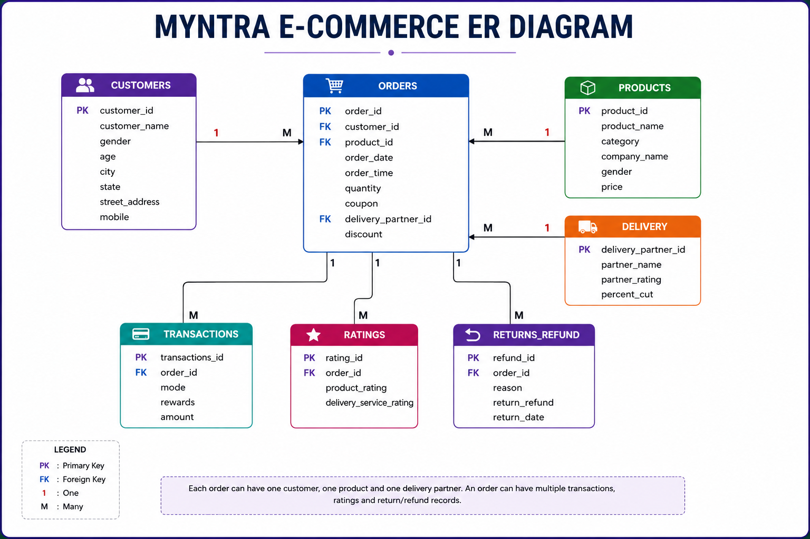
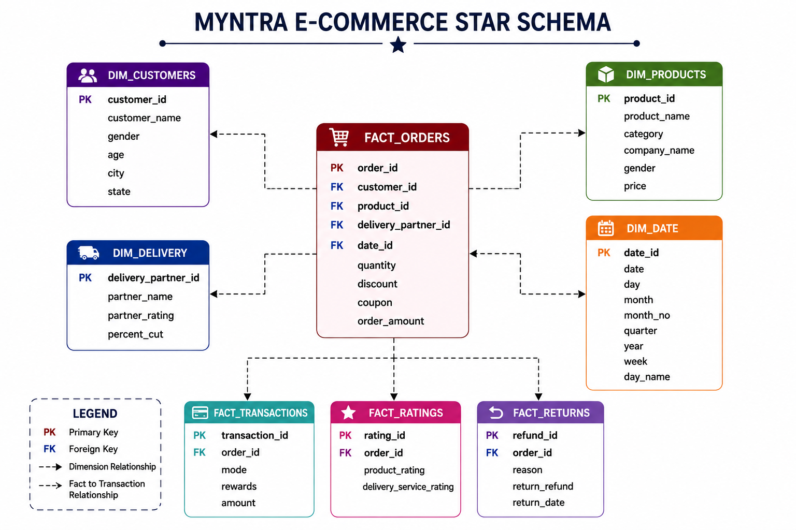
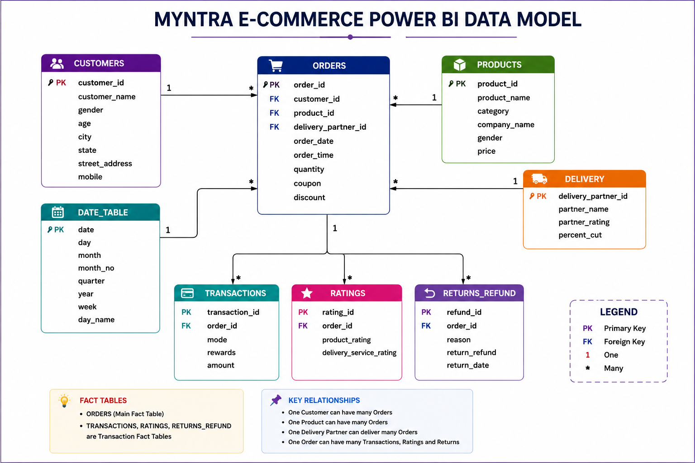

# 🛍️ Myntra E-Commerce Analytics Dashboard

### End-to-End Data Analytics Project using Python, Oracle SQL & Power BI

> An end-to-end Business Intelligence project that covers Data Cleaning, Database Design, SQL Analysis, Data Modeling, DAX and Interactive Power BI Dashboards.

---

<p align="center">


</p>

---

## 📌 Project Overview

This project demonstrates an **end-to-end E-Commerce Analytics solution** developed using **Python, Oracle SQL, and Power BI**.

The complete workflow includes:

- Data Cleaning using Python (Pandas)
- Oracle SQL Database Design
- Primary & Foreign Key Relationships
- Business SQL Analysis
- Data Modeling
- DAX Measures
- Interactive Power BI Dashboard
- Business Insights

The dashboard helps analyze **Sales Performance, Customer Behavior, Product Performance, Returns, Ratings, and Delivery Partner Performance** through interactive reports.

---

# 🗄️ Database Architecture

The project follows a relational database architecture designed in Oracle SQL. The database is normalized using Primary Keys and Foreign Keys to ensure data integrity and efficient querying.

## 📌 Entity Relationship (ER) Diagram

<p align="center">
  
</p>

The ER Diagram represents the relationships between Customers, Orders, Products, Delivery Partners, Transactions, Ratings, and Returns.

---

## ⭐ Star Schema

<p align="center">
  
</p>

The analytical model is centered around the **Orders** fact table with supporting dimension tables such as Customers, Products, Delivery, and Date Table.

---

## 📊 Power BI Data Model

<p align="center">
  
</p>

The Power BI data model establishes one-to-many relationships between dimension and fact tables to support efficient DAX calculations and interactive reporting.

---

# 📈 Dashboard Preview

## 🏠 Executive Dashboard

<p align="center">

</p>

---

## 💰 Sales Analysis

<p align="center">

</p>

---

## 👥 Customer Analysis

<p align="center">

</p>

---

## 📦 Product Analysis

<p align="center">

</p>

---

## 🚚 Returns & Delivery Analysis

<p align="center">

</p>

---

# 📊 Key Performance Indicators (KPIs)

The dashboard tracks the following business KPIs:

- 💰 Total Revenue
- 🛒 Total Orders
- 👥 Total Customers
- ⭐ Average Product Rating
- 📦 Average Order Value
- 🔄 Return Rate
- 🎟 Coupon Usage %
- 🏆 Best Selling Category
- 🚚 Average Delivery Rating
- 💵 Revenue Per Customer

---

# 💡 Business Insights

The dashboard reveals several important business insights:

- 📈 Maharashtra generated the highest revenue.
- 👕 Blazer is the highest revenue generating category.
- 🏆 Pencil Silk Shirt is the best-selling product.
- ⭐ Average product rating is 2.99.
- 🔄 Return rate is 20%.
- 🚚 Ecom Express handled the highest number of deliveries.
- 📅 Tuesday generated the highest revenue.
- 🎟 Nearly 50% of orders used coupons.
- 👥 Male and Female customer distribution is almost equal.

---   

# 📂 Repository Structure

```text
Myntra-Ecommerce-Analytics
│
├── Dataset
│   ├── customers_clean.csv
│   ├── orders_clean.csv
│   ├── products_clean.csv
│   ├── transactions_clean.csv
│   ├── ratings_clean.csv
│   ├── returns_clean.csv
│   └── delivery_clean.csv
│
├── Python
│   ├── Data_Cleaning.ipynb
│   ├── Load_Data_Oracle.ipynb
│
├── Oracle SQL
│   ├── 01_Create_Tables.sql
│   ├── 02_Primary_Keys.sql
│   ├── 03_Foreign_Keys.sql
│   └── 05_Business_Queries.sql
│
├── Power BI
│   └── Myntra_Ecommerce_Dashboard.pbix
│
├── Dashboard Screenshots
│
├── Documentation
│
└── README.md
```

---

# 🚀 How To Run

1. Download the repository.
2. Open Oracle SQL and execute the SQL scripts.
3. Load cleaned CSV files into Oracle Database.
4. Open the Power BI (.pbix) file.
5. Refresh the data source.
6. Explore the interactive dashboards.

---

# 🛠 Skills Demonstrated

- Data Cleaning
- Data Transformation
- Database Design
- Data Modeling
- SQL
- Oracle SQL
- DAX
- Power BI
- Business Intelligence
- Dashboard Design
- Data Visualization

---

# 🔮 Future Enhancements

- Sales Forecasting
- Customer Segmentation
- Product Recommendation System
- Inventory Analytics
- Machine Learning Integration
- Real-time Dashboard

---
# 👨‍💻 Author

**Adarsh Band**

🎯 Aspiring Data Analyst

### Skills

- SQL
- Oracle SQL
- Python
- Pandas
- Power BI
- DAX
- Excel

If you like this project, don't forget to ⭐ this repository.

---
 

